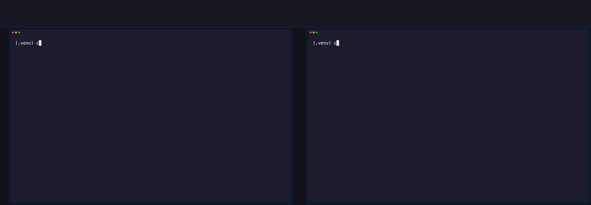
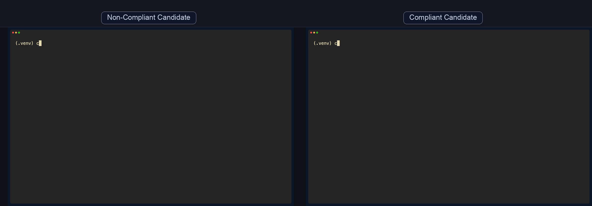
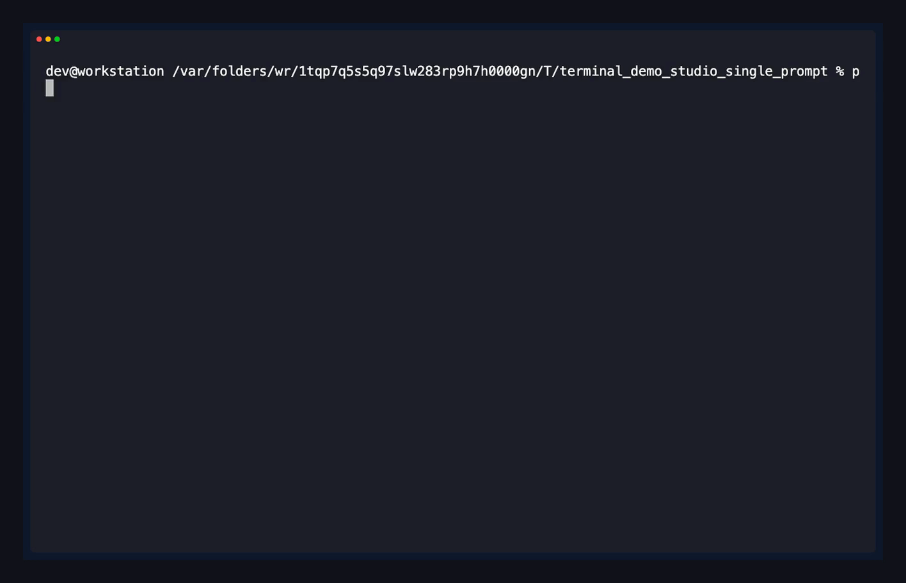
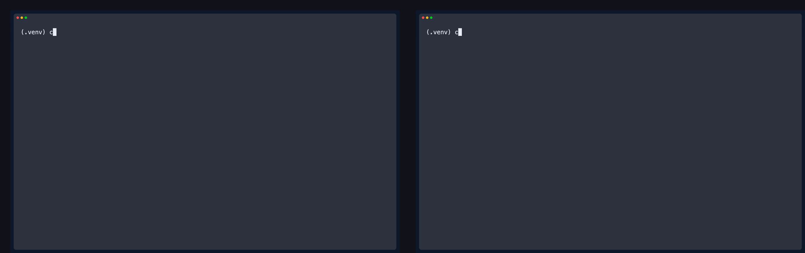

# terminal-demo-studio

Deterministic terminal/TUI demos for docs, launch pages, and agent workflows.

All media is generated from executed sessions (mock or real). No hand-edited frames.



## Agent Automation First

Install the skill:

```bash
npx skills add tomallicino/terminal-demo-studio --skill terminal-demo-studio
```

Agent-friendly bootstrap:

```bash
python3 -m venv .venv
source .venv/bin/activate
pip install -e '.[dev]'

studio init
studio validate screenplays/getting_started.yaml --explain
studio run screenplays/getting_started.yaml --mode scripted_vhs --local --output-dir outputs
```

Example agent prompt:

```text
Create a portable mock complex-TUI demo, validate it, render it locally, and return the output path plus any failures.
```

## 60-Second Quickstart (Docker Optional)

```bash
python3 -m venv .venv
source .venv/bin/activate
pip install -e '.[dev]'

studio doctor --mode auto
studio validate examples/mock/safety_wizard.yaml --explain
studio run examples/mock/safety_wizard.yaml --mode scripted_vhs --local --output-dir outputs --output gif
```

Core workflows are local-first and do not require Docker.

## Compatibility Matrix

| Platform | `scripted_vhs` lane | `autonomous_pty` lane | Docker |
| --- | --- | --- | --- |
| macOS | CI-rendered smoke | CI command/assert smoke | Optional |
| Linux | CI-rendered smoke | CI command/assert smoke | Optional |
| Windows 10/11 (native) | CI scripted render smoke (release gate) | CI command/assert smoke | Optional |

Current autonomous scope: command/assert automation is release-ready. Interactive `input`/`key`/`hotkey` autonomy for complex live TUIs is tracked in `docs/autonomous-roadmap.md`.

## Complex TUI Automation

Portable mock demos are the default public showcase because they are deterministic and cross-platform.

Advanced real-tool demos live in `examples/real/` and are intentionally marked advanced:

1. Require extra setup and pinned manifests.
2. Must include tool version and capture date metadata.
3. Should be run in `--mode autonomous_pty` with explicit assertions.

## Demo Showcase (Portable-First)

1. Hero before/after bugfix flow (Catppuccin Mocha)  
Source screenplay: `screenplays/dev_bugfix_workflow.yaml`  


2. Simultaneous playback comparison (GruvboxDark)  
Source screenplay: `screenplays/agent_generated_release_check.yaml`  


3. Single-pane macOS prompt flow (Dracula)  
Source screenplay: `screenplays/single_prompt_macos_demo.yaml`  


4. Feature-flag workflow before/after (Nord)  
Source screenplay: `screenplays/agent_generated_feature_flag_fix.yaml`  


## Commands

```bash
studio init [--destination PATH] [--template TEMPLATE] [--name NAME] [--force]
studio run <screenplay.yaml> [--mode auto|scripted_vhs|autonomous_pty] \
  [--docker|--local] [--output-dir PATH] [--keep-temp] [--rebuild] \
  [--playback sequential|simultaneous] [--output mp4|gif]
studio validate <screenplay.yaml> [--json-schema] [--explain]
studio new <name> [--template TEMPLATE] [--destination PATH] [--force]
studio new --list-templates
studio doctor [--mode auto|scripted_vhs|autonomous_pty]
```

## What Fails Fast vs Warns

1. `studio run --docker` fails if Docker is unavailable.
2. `studio run` (auto) falls back to local mode if Docker is unavailable.
3. `studio doctor --mode autonomous_pty` warns for missing render binaries.
4. `studio doctor --mode scripted_vhs` surfaces render dependency issues with actionable hints.

## Troubleshooting

1. Missing labels in composed output:
- Run `studio doctor --mode scripted_vhs` and ensure ffmpeg `drawtext` support is available.

2. Docker not running:
- Use `--local` or start Docker and retry.

3. Validation errors:
- Run `studio validate <file> --explain` and fix the exact field path shown.

## Architecture and Specs

- `ARCHITECTURE.md`
- `CAPABILITIES.md`
- `docs/autonomous-roadmap.md`
- `docs/case-studies/feature-flag-bugfix.md`
- `docs/releasing.md`

## Packaging

1. PyPI distribution: `terminal-demo-studio-cli`
2. Python package: `terminal_demo_studio`
3. CLI command: `studio`
4. Skill path: `skills/terminal-demo-studio/SKILL.md`

## License

MIT (`LICENSE`)
