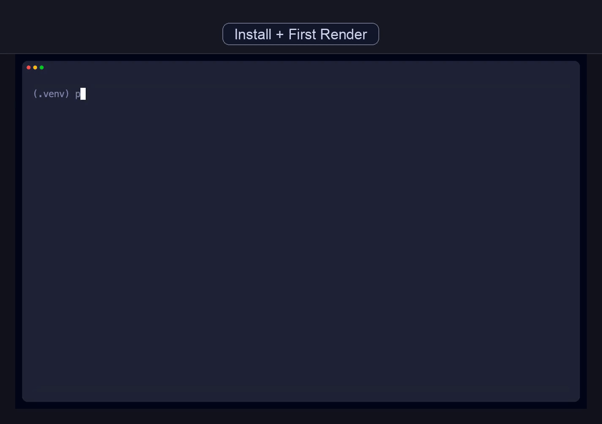
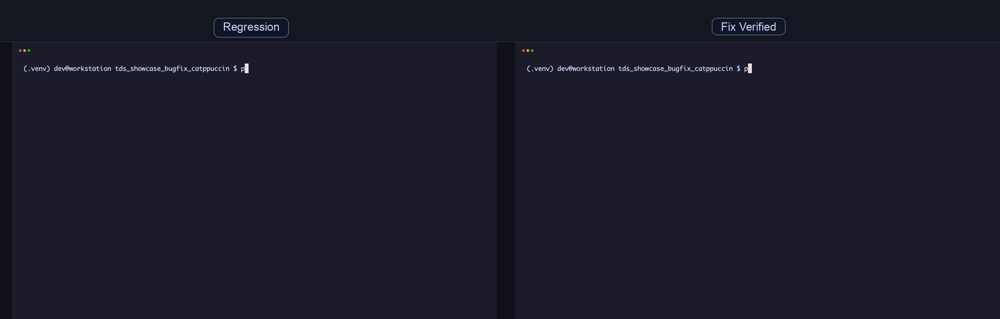
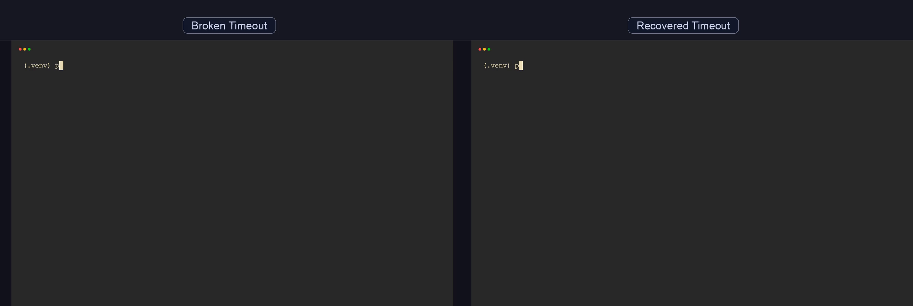
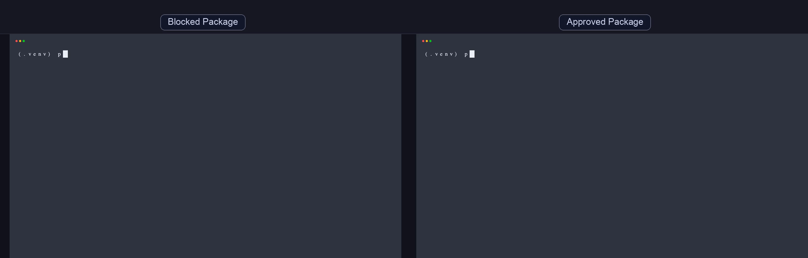
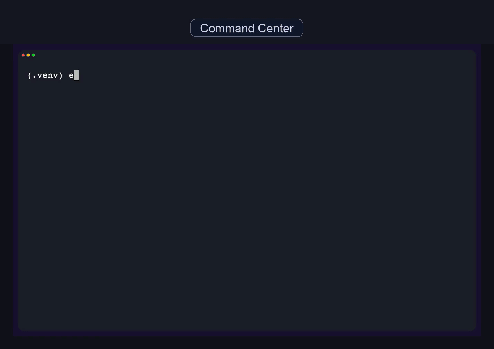
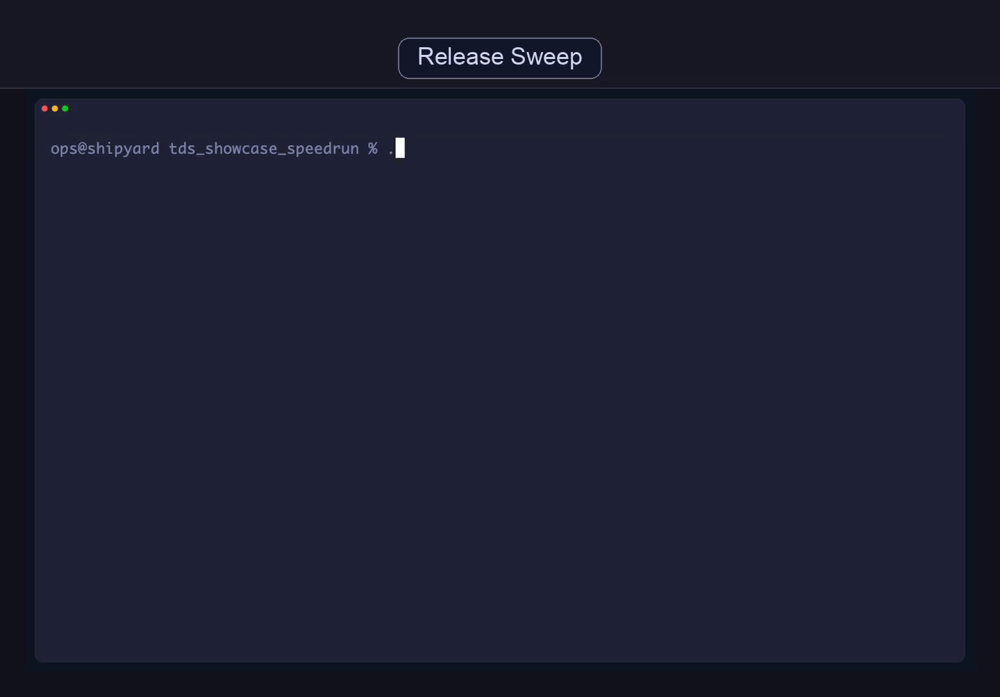
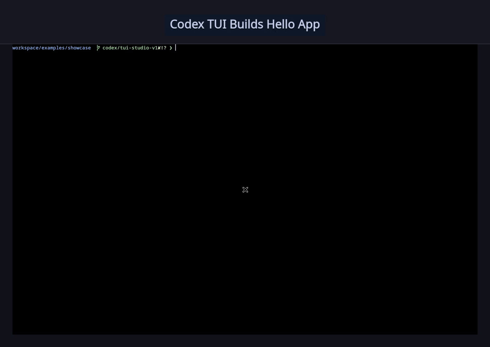
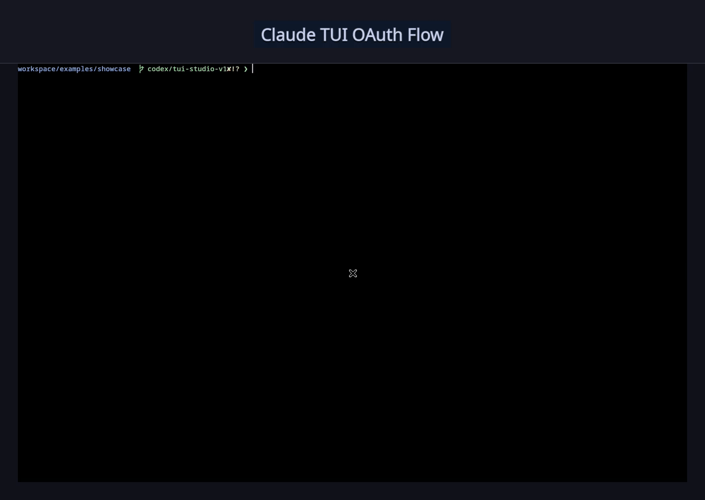

# terminal-demo-studio

[](https://pypi.org/project/terminal-demo-studio/)
[](https://pypi.org/project/terminal-demo-studio/)
[](https://github.com/tomallicino/terminal-demo-studio/actions/workflows/ci.yml)
[](LICENSE)
[](#execution-lanes)
[](#artifact-contract)

Deterministic terminal and TUI demo rendering for docs, launches, and CI. `terminal-demo-studio` turns screenplay YAML into repeatable GIF/MP4 assets plus machine-readable run artifacts.



## Why teams use it

- Deterministic outputs from screenplay + pinned runtime assumptions.
- Three lanes for different needs: polished scripted renders, command/assert autonomy, and visual autonomous capture.
- Agent-native run contract (`STATUS`, `RUN_DIR`, `MEDIA_*`, `SUMMARY`, `EVENTS`).
- Safety controls for autonomous video (`agent_prompts`, lint gates, redaction, bounded waits).

## 60-second quickstart

```bash
pip install terminal-demo-studio
tds init --destination demo_workspace
tds render --template install_first_command --output gif --output-dir outputs
```

The render command emits canonical keys you can parse in scripts and agents:

- `STATUS`
- `RUN_DIR`
- `MEDIA_GIF` / `MEDIA_MP4`
- `SUMMARY`
- `EVENTS` (autonomous lanes)

## Plug-and-play runtime model

- Python runtime deps are packaged in `pyproject.toml` and installed with `pip install terminal-demo-studio`.
- System binaries (`vhs`, `ffmpeg`, `kitty`, `xvfb`) are OS-level deps and are not pip-installable.
- For a zero-manual setup path, use Docker-backed runs (`--docker`), which bundle those binaries in the project image.
- `tds render` auto-selects Docker when available for scripted and visual lanes, then falls back to local execution when appropriate.

## Execution lanes

- `scripted_vhs` (`--mode scripted`): cinematic, deterministic, marketing/docs friendly.
- `autonomous_pty` (`--mode interactive`): command/assert automation with runtime events and failure bundles.
- `autonomous_video` (`--mode visual`): full-screen interactive capture (prompt-loop policies + safety linting).

## Showcase gallery

All assets below were generated from this repo with:

```bash
./scripts/render_showcase_media.sh
```

### 1) Onboarding Neon (`scripted_vhs`, TokyoNightStorm + Menlo)

[GIF](docs/media/onboarding_tokyo_neon.gif) · [MP4](docs/media/onboarding_tokyo_neon.mp4) · [YAML](examples/showcase/onboarding_tokyo_neon.yaml)


### 2) Bugfix Glow (`scripted_vhs`, Catppuccin Mocha + Monaco)

[GIF](docs/media/bugfix_catppuccin_glow.gif) · [MP4](docs/media/bugfix_catppuccin_glow.mp4) · [YAML](examples/showcase/bugfix_catppuccin_glow.yaml)



### 3) Recovery Retro (`scripted_vhs`, GruvboxDark + Courier New)

[GIF](docs/media/recovery_gruvbox_retro.gif) · [MP4](docs/media/recovery_gruvbox_retro.mp4) · [YAML](examples/showcase/recovery_gruvbox_retro.yaml)



### 4) Policy Guard (`scripted_vhs`, nord + SF Mono)

[GIF](docs/media/policy_nord_guard.gif) · [MP4](docs/media/policy_nord_guard.mp4) · [YAML](examples/showcase/policy_nord_guard.yaml)



### 5) Menu Contrast (`scripted_vhs`, Dracula + Courier)

[GIF](docs/media/menu_dracula_contrast.gif) · [MP4](docs/media/menu_dracula_contrast.mp4) · [YAML](examples/showcase/menu_dracula_contrast.yaml)



### 6) Nightshift Speedrun (`scripted_vhs`, TokyoNightStorm + Monaco)

[GIF](docs/media/speedrun_nightshift.gif) · [MP4](docs/media/speedrun_nightshift.mp4) · [YAML](examples/showcase/speedrun_nightshift.yaml)



### 7) Autonomous Codex Real TUI (`autonomous_video`, builds + verifies hello app)

[GIF](docs/media/autonomous_codex_real_short.gif) · [MP4](docs/media/autonomous_codex_real_short.mp4) · [YAML](examples/showcase/autonomous_codex_real_short.yaml)



### 8) Autonomous Claude Code Real TUI (`autonomous_video`, onboarding + OAuth flow)

[GIF](docs/media/autonomous_claude_real_short.gif) · [MP4](docs/media/autonomous_claude_real_short.mp4) · [YAML](examples/showcase/autonomous_claude_real_short.yaml)



## CLI surface

```bash
tds render <screenplay.yaml> [--mode auto|scripted|interactive|visual] \
  [--docker|--local] [--output-dir PATH] [--playback sequential|simultaneous] \
  [--output gif|mp4] [--agent-prompts auto|manual|approve|deny] [--redact auto|off|input_line]

tds run <screenplay.yaml> [same options as render]
tds validate <screenplay.yaml> [--json-schema] [--explain]
tds lint <screenplay.yaml> [--json] [--strict]
tds new <name> [--template TEMPLATE] [--destination PATH] [--force]
tds new --list-templates
tds init [--destination PATH] [--template TEMPLATE] [--name NAME] [--force]
tds doctor [--mode auto|scripted|interactive|visual]
tds debug <run_dir> [--json]
```

## Screenplay quick reference

```yaml
title: "Demo Title"
output: "demo_slug"
settings:
  width: 1440
  height: 900
  theme: "TokyoNightStorm"
  font_family: "Menlo"
scenarios:
  - label: "Scenario A"
    surface: "terminal"
    execution_mode: "scripted_vhs" # or autonomous_pty / autonomous_video
    setup:
      - "echo setup"
    actions:
      - type: "echo hello"
      - wait_for: "hello"
        wait_mode: "screen"
        wait_timeout: "5s"
```

## Safety and reliability

- `tds lint` checks autonomous prompt policy and unsupported action usage before execution.
- `--agent-prompts auto|manual|approve|deny` controls autonomous approval behavior.
- `--redact auto|off|input_line` controls media masking strategy.
- Failure bundles include redacted diagnostics (`failure/reason.txt`, `failure/screen.txt`, `failure/step.json`, logs).

## Artifact contract

Each run writes `.terminal_demo_studio_runs/<run-id>/` with:

- `manifest.json`
- `summary.json`
- `media/*.gif|*.mp4`
- `scenes/scene_*.mp4` and `tapes/scene_*.tape` (scripted lane)
- `runtime/events.jsonl` (autonomous lanes)
- `failure/*` on failure

## Agent workflow

Install the skill:

```bash
npx skills add tomallicino/terminal-demo-studio --skill terminal-demo-studio
```

High-signal prompt:

```text
Render examples/showcase/policy_nord_guard.yaml in scripted mode.
Return STATUS, RUN_DIR, MEDIA_GIF, MEDIA_MP4, and SUMMARY.
If status is failed, run `tds debug <run_dir> --json` and summarize root cause.
```

## Additional docs

- [Architecture](ARCHITECTURE.md)
- [Capability registry](CAPABILITIES.md)
- [Reproducibility](docs/reproducibility.md)
- [Autonomous roadmap](docs/autonomous-roadmap.md)
- [GitHub Action guide](docs/github-action.md)
- [Release checklist](docs/releasing.md)
- [Showcase gallery index](docs/showcase-gallery.md)
- [Feature-flag case study](docs/case-studies/feature-flag-bugfix.md)

## License

MIT ([LICENSE](LICENSE))
