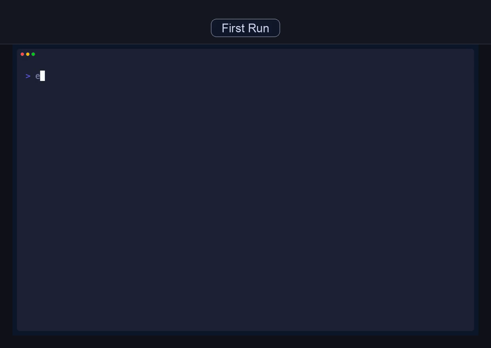
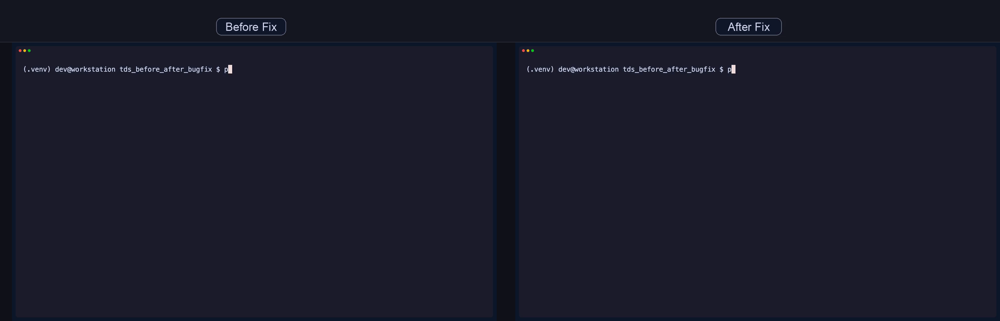
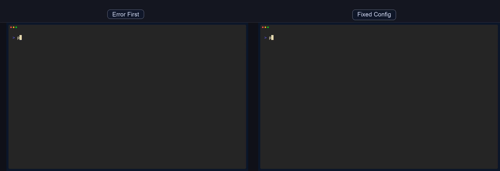
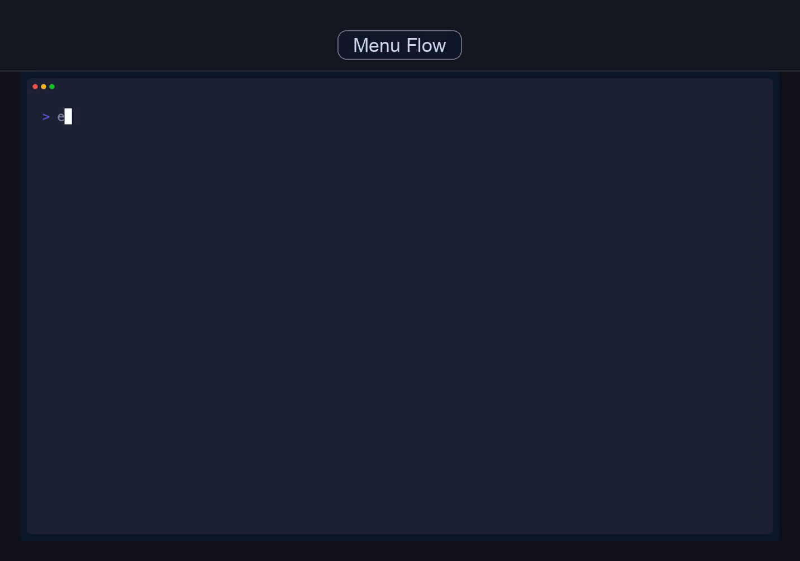
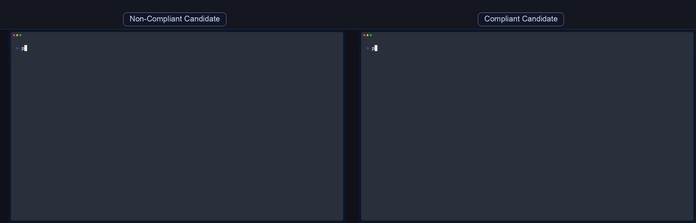
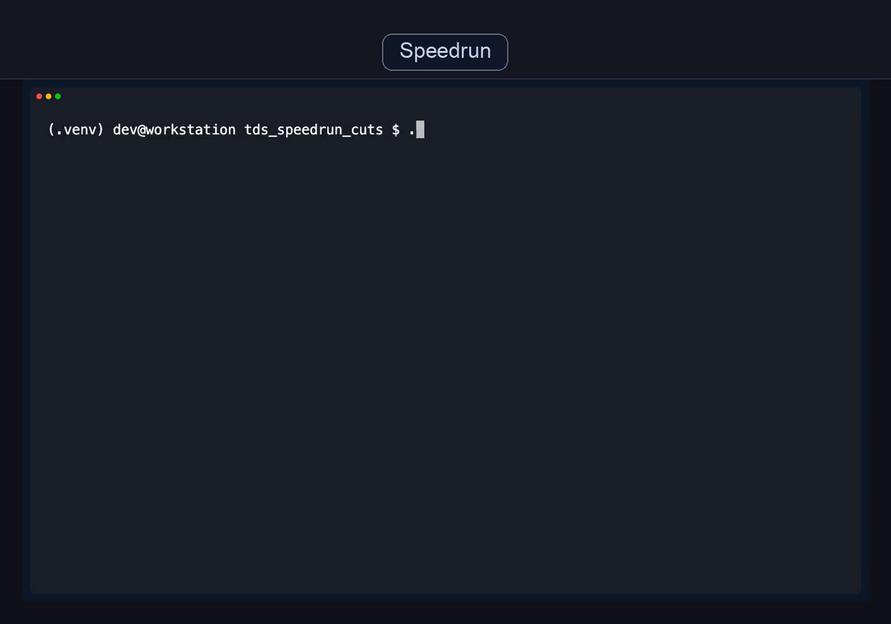

# terminal-demo-studio

Deterministic terminal demo generation for docs, release pages, and agent workflows.

Built on [Charm VHS](https://github.com/charmbracelet/vhs), with a CI-grade screenplay layer, canonical run artifacts, and executed-session authenticity.

All showcase media is generated from executed sessions (mock or real), never hand-edited frames.

## 60-Second Wow Path

```bash
pipx install terminal-demo-studio-cli
tds render --template install_first_command --output gif --output-dir outputs
```



Migration note: the `studio` command was removed in alpha. Use `tds`.

## Agent-First Automation

Install the skill:

```bash
npx skills add tomallicino/terminal-demo-studio --skill terminal-demo-studio
```

Agent prompt example:

```text
Render a portable demo template, return RUN_DIR and MEDIA_GIF, then summarize any failures with tds debug --json.
```

## Installation

Recommended for users:

```bash
pipx install terminal-demo-studio-cli
```

Developer setup:

```bash
python3 -m venv .venv
source .venv/bin/activate
pip install -e '.[dev]'
```

## Compatibility Matrix

| Platform | `scripted_vhs` lane | `autonomous_pty` lane | `autonomous_video` lane | Docker |
| --- | --- | --- | --- | --- |
| macOS | Supported (CI smoke) | Supported (CI smoke) | Experimental | Optional |
| Linux | Supported (CI smoke) | Supported (CI smoke) | Experimental | Optional |
| Windows 10/11 | Supported for users, CI parity deferred | Supported (CI smoke) | Docker-only path | Optional |

Docker is optional for core workflows.

## Stable vs Experimental

- Stable: `scripted_vhs` lane (`tds render/run --mode scripted_vhs`).
- Stable (limited): `autonomous_pty` command/assert lane.
- Experimental: `autonomous_video` interactive lane and broader autonomous interactive coverage roadmap.

## Commands

```bash
tds render <screenplay.yaml> [--mode auto|scripted_vhs|autonomous_pty|autonomous_video] \
  [--docker|--local] [--output-dir PATH] [--playback sequential|simultaneous] \
  [--output gif|mp4]

tds render --template <template_id> [--name NAME] [--destination PATH] \
  [--mode scripted_vhs] [--local] [--output gif|mp4]

tds run <screenplay.yaml> [same options as render]
tds validate <screenplay.yaml> [--json-schema] [--explain]
tds new <name> [--template TEMPLATE] [--destination PATH] [--force]
tds new --list-templates
tds init [--destination PATH] [--template TEMPLATE] [--name NAME] [--force]
tds doctor [--mode auto|scripted_vhs|autonomous_pty|autonomous_video]
tds debug <run_dir> [--json]
```

## Golden Templates (Launch Pack)

Use `tds new --list-templates` to scaffold these six templates:

1. `install_first_command`  
What it shows: install + first render success.  
Source: `examples/mock/install_first_command.yaml`  


2. `before_after_bugfix`  
What it shows: two-pane failing-to-passing bugfix narrative.  
Source: `examples/mock/before_after_bugfix.yaml`  


3. `error_then_fix`  
What it shows: error-first config workflow with deterministic fix.  
Source: `examples/mock/error_then_fix.yaml`  


4. `interactive_menu_showcase`  
What it shows: menu-style interaction sequence with deterministic playback.  
Source: `examples/mock/interactive_menu_showcase.yaml`  


5. `policy_warning_gate`  
What it shows: non-compliant vs compliant release gate comparison.  
Source: `examples/mock/policy_warning_gate.yaml`  


6. `speedrun_cuts`  
What it shows: fast release-gate style command outputs.  
Source: `examples/mock/speedrun_cuts.yaml`  


## Demo-as-Build-Artifact

Every run writes a canonical run directory under `.terminal_demo_studio_runs/`:

- `manifest.json`
- `summary.json`
- `media/*.gif|*.mp4`
- `scenes/scene_*.mp4` (scripted lane)
- `tapes/scene_*.tape` (scripted lane)
- `runtime/events.jsonl` (autonomous lanes)
- `failure/*` on errors

`tds debug <run_dir>` provides compact triage output, and `--json` is agent-friendly.

## Reproducibility Guarantees

Determinism knobs and environment guidance:

- `docs/reproducibility.md`

## GitHub Action (Copy/Paste)

Reusable render action docs:

- `docs/github-action.md`
- action path: `.github/actions/render`

## Troubleshooting

1. Missing local render dependencies:

```bash
tds doctor --mode scripted_vhs
```

2. Docker unavailable for explicit Docker runs:

```bash
tds render ... --local
```

3. Failed run triage:

```bash
tds debug <run_dir>
tds debug <run_dir> --json
```

## Additional Docs

- `ARCHITECTURE.md`
- `CAPABILITIES.md`
- `docs/autonomous-roadmap.md`
- `docs/case-studies/feature-flag-bugfix.md`
- `docs/releasing.md`

## License

MIT (`LICENSE`)
